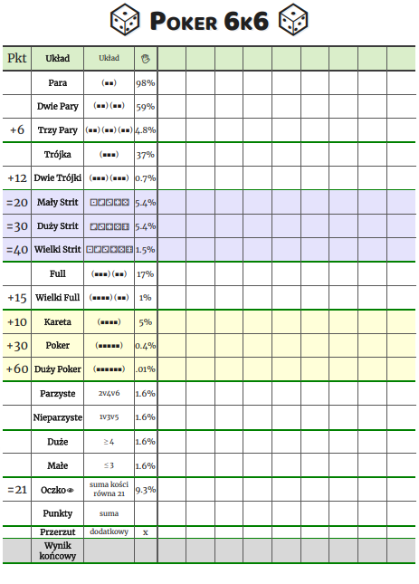
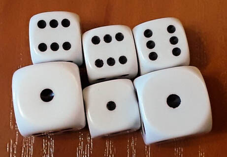
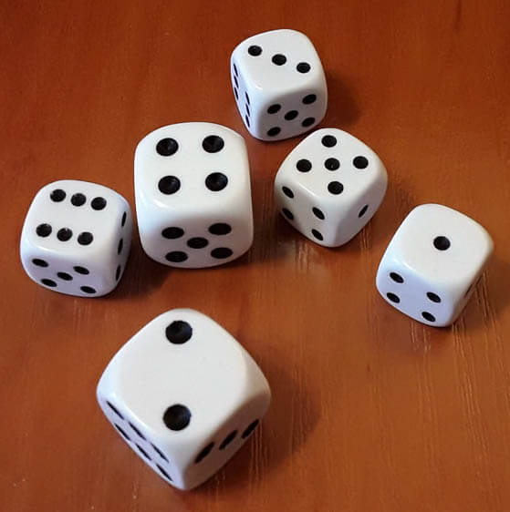
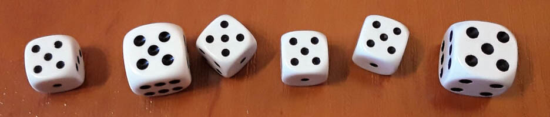

# Poker 6k6

🎲🎲🎲🎲🎲🎲  
Gra w kości!
Gra oparta jest na pokerze na pięć kości sześciościennych, ale jest rozszerzona o jedną kość i nowe układy, takie jak trzy pary i oczko.

## Drukowanie planszy

### Opcja 1: Drukowanie z pdf

[Tabela w .PDF](https://github.com/Tymski/6k6/raw/master/data/pdf/6k6.pdf)

### Opcja 2: Drukowanie z przeglądarki

Po wejściu na https://tymski.github.io/6k6, wciśnij Ctrl+P aby otworzyć okno drukowania.  
Zalecane ustawienia drukowania: układ pionowy, druk kolorowy, brak marginesów, skalowanie 100%, drukuj obraz w tle.  

## Zasady gry

W grę można grać w dowolną liczbę graczy, jednak im więcej graczy, tym dłużej będzie trzeba czekać na swoją kolejkę.

Celem gry jest uzyskanie największej liczby punktów spośród wszystkich graczy.

W każdej z rund gracz ma 3 rzuty. Pierwszy rzut zawsze odbywa się sześcioma kostkami, natomiast dwa pozostałe są nieobowiązkowe, a ilość rzucanych kostek zależy od gracza.

Po wykonaniu rzutów gracz zapisuje punkty do wybranej przez siebie kategorii. Ilość punktów zależna jest od ilości wyrzuconych oczek oraz bonusowych punktów za układ.

|      Układ       |                                                  dokładny opis układu                                                  |    liczba uzyskanych punktów    |
| :--------------: | :--------------------------------------------------------------------------------------------------------------------: | :-----------------------------: |
|     **Para**     |                           dwie kości z tą samą liczbą oczek, pozostałe cztery się nie liczą                            |  suma oczek sparowanych kości   |
|  **Dwie pary**   |     dwie kości z tą samą liczbą oczek, dwie inne kości z tą samą liczbą oczek, pozostałe dwie kości się nie liczą      |  suma oczek sparowanych kości   |
|  **Trzy pary**   | dwie kości z tą samą liczbą oczek, dwie inne kości z tą samą liczbą oczek, dwie pozostałe kości z tą samą liczbą oczek | suma oczek sparowanych kości +6 |
|  **Mały Strit**  |                           w układzie występują kości z 1 2 3 4 5, szósta kość się nie liczy                            |               20                |
|  **Duży Strit**  |                           w układzie występują kości z 2 3 4 5 6, szósta kość się nie liczy                            |               30                |
| **Wielki Strit** |                                                  układ to 1 2 3 4 5 6                                                  |               40                |
|    **Trójka**    |                            trzy kości z tą samą liczbą oczek, pozostałe trzy się nie liczą                             |     suma oczek trzech kości     |
| **Dwie Trójki**  |                     trzy kości z tą samą liczbą oczek, trzy pozostałe kości z tą samą liczbą oczek                     |  suma oczek sześciu kości +12   |
|     **Full**     |        dwie kości z tą samą liczbą oczek, trzy inne kości z tą samą liczbą oczek, pozostała kość się nie liczy         |     suma oczek pięciu kości     |
| **Wielki Full**  |                         dwie kości z tą samą liczbą oczek, cztery kości z tą samą liczbą oczek                         |  suma oczek sześciu kości +15   |
|    **Kareta**    |                           cztery kości z tą samą liczbą oczek, pozostałe dwie się nie liczą                            |  suma oczek czterech kości +10  |
|    **Poker**     |                            pięć kości z tą samą liczbą oczek, pozostała kość się nie liczy                             |   suma oczek pięciu kości +30   |
|  **Duży Poker**  |                                           sześć kości z tą samą liczbą oczek                                           |  suma oczek sześciu kości +60   |
|     **Duże**     |                                           każda z kości ma 4, 5 lub 6 oczek                                            |    suma oczek sześciu kości     |
|     **Małe**     |                                           każda z kości ma 1, 2 lub 3 oczka                                            |    suma oczek sześciu kości     |
|   **Parzyste**   |                                         każda z kości ma parzystą ilość oczek                                          |    suma oczek sześciu kości     |
| **Nieparzyste**  |                                        każda z kości ma nieparzystą ilość oczek                                        |    suma oczek sześciu kości     |
|    **Oczko**     |                                          suma oczek z sześciu kości wynosi 21                                          |               21                |
|    **Punkty**    |                                                dowolne ustawienie kości                                                |    suma oczek sześciu kości     |

Raz na grę, gracz może wykorzystać przerzut, czyli czwarty rzut w rundzie. Powinien on poinformować pozostałych graczy przed wykonaniem czwartego rzutu i wykreślić przerzut z tabeli.

## Przykłady

  
  
Układ **1 1 1 6 6 6**. Gracz może wybrać jeden z układów: Dwie trójki (33 punkty), Oczko (21 punktów), Punkty (21 punktów), Fulla (20 punktów), Trójkę (18 punktów), Fulla (15 punktów), Dwie pary (14 punktów), Parę (12 punktów), Trójkę (3 punkty), Parę (2 punkty).
  
  
  
Układ **1 2 3 4 5 6**. Gracz może wybrać jeden z układów: Wielkiego strita (40 punktów), Dużego strita (30 punktów), Oczko (21 punktów), Punkty (21 punktów) albo Małego strita (20 punktów).  

  
  
Układ **5 5 5 5 5 5**. Gracz trafił Wielkiego Pokera (90 punktów), ale jeśli już wykreślił tę opcję, może jeszcze wybrać Pokera (55 punktów), Wielkiego Fulla(45 punktów), Dwie Trójki (42 punkty), Trzy pary (36 punktów), Karetę (34 punktów), Nieparzyste (30 punktów), Duże (30 puktów), Punkty (30 punktów), Fulla (25 punktów), Dwie pary (20 punktów), Trójkę (15 punktów), Parę (10 punktów).  

Układ **6 6 6 6 4 2**. Gracz może wybrać jako układ Parę (12 punktów), Trójkę (18 punktów), Dwie Pary (24 punkty), Karetę (34 punkty), Parzyste lub Punkty (30 punktów).
